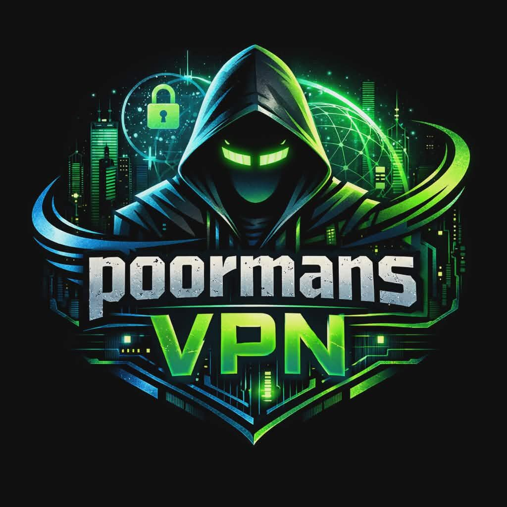

<h1 align="center">poormanVPN</h1>

<p align="center">
  <strong>Eight ports. One wallet. Zero trust required.</strong>
</p>

<p align="center">
  Wallet-authenticated SSH infrastructure with integrated VPN tunneling.<br />
  Terminal. File transfer. TCP/UDP/DNS proxy. Claude AI. All from a handheld interface.
</p>

<br />

<div align="center">
  <a href="pmvpn/">
    <picture>
      
    </picture>
  </a>
</div>

<br />

<p align="center">
  <a href="pmvpn/"><strong>Documentation</strong></a> ·
  <a href="pmvpn/docs/DEPLOYMENT.md"><strong>Deploy</strong></a> ·
  <a href="pmvpn/docs/PROTOCOL.md"><strong>Protocol</strong></a> ·
  <a href="pmvpn/docs/BOOTSTRAP.md"><strong>Bootstrap</strong></a> ·
  <a href="https://agenticplace.pythai.net"><strong>AgenticPlace</strong></a>
</p>

---

Your wallet is your SSH key. Your signature is your password. pmVPN replaces traditional remote access credentials with Ethereum wallet signatures — cryptographic identity that works the same whether you are at home, in transit, or on a phone in another country. No passwords to remember. No key files to manage. No VPN provider standing between you and your machine.

The server opens eight dedicated ports — interactive shell, SFTP, command execution, authentication API, VPN tunnel, file synchronization, Claude AI proxy, and administration. Each port serves one purpose. All traffic flows through SSH encrypted with Ed25519, curve25519-sha256, and chacha20-poly1305. The authentication is a single wallet signature verified locally via [viem](https://viem.sh/) — no blockchain RPC, no external service, no network dependency.

The client is a module of [PARSEC Wallet](https://github.com/cypherpunk2048/parsec-wallet). Vanilla TypeScript. Tauri 2 with Rust backend. xterm.js terminal. Wallet signing in Rust memory via bankon_vault (Argon2id + AES-256-GCM). Private keys never leave the vault. On lock, all sessions disconnect and signing keys are zeroized.

The VPN tunnel uses the [PM Protocol](pmvpn/docs/PROTOCOL.md) — an in-house binary multiplexing protocol inspired by [sshuttle](https://github.com/poormanvpn/sshuttle). TCP, UDP, and DNS streams share a single SSH channel through 8-byte framed messages with 16-bit channel IDs. Up to 65,535 concurrent streams. Flow control at 32KB. No Python. No root on the server.

Four server dependencies. No Express. No WebSocket library. Minimal attack surface on a hostile internet.

---

<div align="center">

### Install

</div>

```bash
git clone https://github.com/poormanvpn/pmVPN.git
cd pmVPN/pmvpn/server
pnpm install
WALLET_USER_MAP="0xYourWalletAddress:username" pnpm run dev
```

```bash
curl http://localhost:2203/status
# → { "version": "0.1.0", "uptime": 0, "wallets": 1 }
```

Eight ports bind on startup. Ed25519 host key auto-generated. Ready to accept wallet-authenticated connections.

---

<div align="center">

### What You Get

</div>

| Port | Service | What It Does |
|:----:|---------|--------------|
| +0 | **Shell** | Interactive terminal. Run Claude, bash, vim, htop — real PTY via node-pty |
| +1 | **SFTP** | File transfer. Browse, upload, download remote filesystem |
| +2 | **Exec** | Non-interactive commands. Scripting, automation, health checks |
| +3 | **Auth** | Challenge nonce endpoint. Client fetches here before SSH connect |
| +4 | **Tunnel** | VPN. Multiplexed TCP/UDP/DNS over SSH. 65K concurrent streams |
| +5 | **Sync** | Bidirectional file synchronization |
| +6 | **Claude** | Dedicated AI assistant channel. Run Claude on remote machines |
| +7 | **Admin** | Server health, active sessions, connection metrics |

---

<div align="center">

### How Authentication Works

</div>

```
  Wallet ────── sign challenge ──────► SSH connect ────── verify signature ──────► Shell
    │                                      │                                        │
    │  "PMVPN:<nonce>:<timestamp>"         │  password = { address,                 │  PTY
    │  signed with secp256k1               │    signature, nonce }                  │  spawned
    │  key never leaves vault              │  single-use nonce                      │  as user
```

No blockchain. No RPC. No external service. `viem.verifyMessage()` recovers the signer address from the signature using pure local elliptic curve math. The nonce is 32 random bytes with a 60-second lifetime, deleted after one use.

---

<div align="center">

### Self-Installation

</div>

pmVPN can [bootstrap its own server](pmvpn/docs/BOOTSTRAP.md) onto any machine you can reach.

| You Have | pmVPN Does |
|----------|------------|
| Regular SSH login | Installs in `~/`, runs on ports 8200+, no admin needed |
| sudo access | Installs to `/opt/`, standard ports 2200+, systemd service |
| Any shell (container, console) | ssh2 IS the SSH server — no OpenSSH required |

Upload via SFTP. Execute via SSH. The server starts. Connect with your wallet.

---

<div align="center">

### Security

</div>

| | |
|:--|:--|
| **Algorithms** | Ed25519 · curve25519-sha256 · chacha20-poly1305 · keccak256 |
| **Rejected** | RSA · NIST curves · agent forwarding · X11 · password fallback |
| **Vault** | Argon2id + AES-256-GCM in Rust memory · zeroized on lock |
| **Nonces** | In-memory only · 60s TTL · single-use · 1000 hard cap |
| **Dependencies** | ssh2 · node-pty · viem · pino — four packages, all MIT |

Thank [OpenBSD](https://www.openssh.com/).

---

<div align="center">

### Documentation

</div>

| | |
|:--|:--|
| **[pmVPN Technical README](pmvpn/README.md)** | Complete reference — architecture, auth flow, security model, configuration, file structure, dependency audit, cryptographic primitives |
| **[Usage Guide](pmvpn/docs/USAGE.md)** | Step-by-step: server setup, client setup, local testing, remote connection |
| **[PM Protocol Specification](pmvpn/docs/PROTOCOL.md)** | Binary wire format, command codes, channel lifecycle, flow control |
| **[Deployment Guide](pmvpn/docs/DEPLOYMENT.md)** | Production: systemd, firewall, wallet map, monitoring |
| **[Bootstrap Guide](pmvpn/docs/BOOTSTRAP.md)** | Self-installation, zero-SSH containers, key exchange |
| **[Client Module](pmvpn/docs/CLIENT.md)** | Standalone + PARSEC, WebSocket, Terminal/Files/Share tabs |
| **[Android Guide](pmvpn/docs/ANDROID.md)** | Build environment, APK build, phone install, browser fallback |
| **[MetaMask Auth](pmvpn/docs/metamaskbestpractice.md)** | Disconnect standard practice, lock detection, mandatory signature |
| **[Development Roadmap](pmvpn/docs/DEVELOPMENT.md)** | 9 of 10 phases complete, 41 commits |

---

<div align="center">

### Heritage

</div>

**[OpenSSH](https://www.openssh.com/)** — the foundation. **[sshuttle](https://github.com/sshuttle/sshuttle)** — the [inspiration](https://github.com/poormanvpn/sshuttle). **[Paramiko](https://www.paramiko.org/)** — the laboratory. **[ssh2](https://github.com/mscdex/ssh2)** — the engine. **[viem](https://viem.sh/)** — the verifier. **[Tauri](https://tauri.app/)** — the vehicle. **[PARSEC](https://github.com/cypherpunk2048/parsec-wallet)** & **[bankonOS](https://github.com/cypherpunk2048)** — the home. **[RustCrypto](https://github.com/RustCrypto)** — the shield.

---

<div align="center">

### License

**Server**: MIT — deploy anywhere &nbsp;·&nbsp; **Client**: GPL-3.0 — user freedom protected &nbsp;·&nbsp; **Shared**: MIT

</div>

---

## Contributors

<p align="center"><em>The idea that a wallet key is the login key</em></p>

<table align="center">
  <tr>
    <td align="center" width="300" style="padding: 24px;">
      <a href="https://github.com/Professor-Codephreak">
        
      </a>
      <br /><br />
      <strong><a href="https://github.com/Professor-Codephreak">Professor Codephreak</a></strong>
      <br />
      <sub>cSSHwallet prototypes · bankon-greeter auth pattern<br />cypherpunk2048 protocol · PARSEC Wallet · bankonOS<br /><em>Wallet-as-login-key architect</em></sub>
    </td>
    <td align="center" width="300" style="padding: 24px;">
      <a href="https://github.com/Web3dGuy">
        
      </a>
      <br /><br />
      <strong><a href="https://github.com/Web3dGuy">Web3dGuy</a></strong>
      <br />
      <sub>Wallet-authenticated SSH concept · Web3 development<br />3D immersive experience · Spatial interface<br /><em>Wallet-as-login-key architect</em></sub>
    </td>
  </tr>
</table>

---

<p align="center">
  <strong>Code is law. Keys are identity. Verification replaces trust.</strong>
</p>
<p align="center">
  <a href="https://github.com/cypherpunk2048">cypherpunk2048</a> · Professor Codephreak
</p>
<p align="center">
  <a href="https://github.com/poormanvpn">github.com/poormanvpn</a>
</p>
