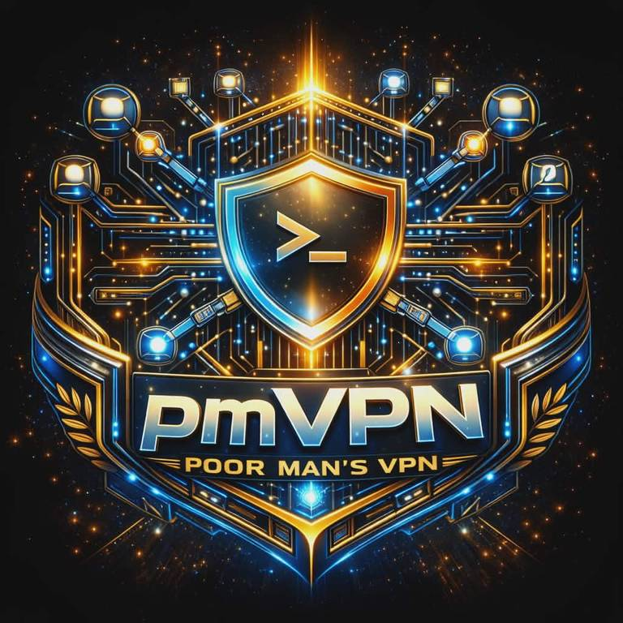

<h1 align="center">pmVPN</h1>
<p align="center"><em>Poor Man's VPN — Wallet-Authenticated Remote Access</em></p>
<p align="center">v0.1.0 · Alpha · MIT Server · GPL Client</p>

<div align="center">
  <picture>
    
  </picture>
</div>

<br />

<div align="center">
  <a href="https://agenticplace.pythai.net">
    <picture>
      
    </picture>
  </a>
</div>

---

> *Your wallet is your key. Your signature is your password. Eight ports. Zero trust required.*

---

## A Note on What This Is

pmVPN exists because remote access should not depend on third parties. No VPN provider standing between you and your machine. No password database waiting to be breached. No SSH key files scattered across devices, lost in backups, or forgotten on decommissioned laptops.

A cryptocurrency wallet already solves the identity problem. It holds a private key you control. It produces signatures that prove who you are without revealing that key. It works the same way whether you are at home, in an airport, or on a phone in another country.

pmVPN takes that identity and makes it the only credential you need. Connect your wallet. Sign a challenge. Eight encrypted ports open between you and your machine — terminal, file transfer, VPN tunnel, AI assistant. Everything over SSH. Everything authenticated by a signature that only your wallet can produce.

The server is four dependencies and an Ed25519 host key. The client is a module inside your wallet. The protocol is documented and open. The code is in-house because production infrastructure on a hostile internet should minimize its trust surface.

This is not a consumer product. It is infrastructure for people who run their own machines and want to access them from anywhere, securely, with nothing but a wallet.

---

## What pmVPN Does

**Terminal access.** Open interactive shell sessions on remote Linux machines. Run Claude, bash, vim, htop — anything that runs in a terminal. Real PTY emulation via node-pty. Full xterm.js rendering in the client.

**File transfer.** SFTP on a dedicated port. Browse, upload, download. The file system of your remote machine, accessible through wallet authentication.

**Command execution.** Non-interactive SSH exec for scripting and automation. Run commands on remote machines without opening a terminal session.

**VPN tunneling.** The PM Protocol multiplexes TCP, UDP, and DNS streams over a single SSH channel. Route traffic through your server. Resolve DNS through your server. Up to 65,535 concurrent streams through one authenticated connection.

**Claude AI proxy.** A dedicated SSH channel for AI assistant interaction. Run Claude on remote machines from a handheld interface. The first use case that motivated this entire project.

**Multi-host management.** Connect to multiple machines simultaneously. Switch between terminals. Monitor connection status across your infrastructure.

**Self-installation.** pmVPN can bootstrap its own server onto any machine you can reach — even containers with no SSH server installed. The ssh2 library IS an SSH server. Upload, install, connect.

---

## Architecture

```
  ┌──────────────────────────────────────────────────────────────┐
  │                        PARSEC Wallet                         │
  │  ┌────────────────────────────────────────────────────────┐  │
  │  │                    pmVPN Module                         │  │
  │  │                                                         │  │
  │  │  ┌─────────┐  ┌───────────┐  ┌──────────┐             │  │
  │  │  │ xterm.js│  │ Connector │  │  Store   │             │  │
  │  │  │Terminal │  │ Auth Flow │  │  Hosts   │             │  │
  │  │  └────┬────┘  └─────┬─────┘  └──────────┘             │  │
  │  │       │              │                                  │  │
  │  │  ─────┴──────────────┴──── Tauri IPC ────────────────  │  │
  │  │                                                         │  │
  │  │  ┌──────────────────────────────────────────────────┐  │  │
  │  │  │              Rust Backend (Tauri 2)               │  │  │
  │  │  │  ┌──────────┐  ┌───────────┐  ┌──────────────┐  │  │  │
  │  │  │  │  russh   │  │  k256     │  │ bankon_vault │  │  │  │
  │  │  │  │SSH Client│  │ EVM Sign  │  │ Key Storage  │  │  │  │
  │  │  │  └──────────┘  └───────────┘  └──────────────┘  │  │  │
  │  │  └──────────────────────────────────────────────────┘  │  │
  │  └────────────────────────────────────────────────────────┘  │
  └──────────────────────────────────────────────────────────────┘
                               │
                    Wallet-Signed SSH (encrypted)
                               │
  ┌──────────────────────────────────────────────────────────────┐
  │                       pmVPN Server                           │
  │                                                              │
  │   Port +0 ─── SSH Shell ──── node-pty PTY ──── /bin/bash    │
  │   Port +1 ─── SFTP ───────── ssh2 SFTP subsystem            │
  │   Port +2 ─── SSH Exec ───── One-shot command execution      │
  │   Port +3 ─── Challenge ──── HTTP nonce endpoint             │
  │   Port +4 ─── VPN Tunnel ─── PM Protocol (TCP/UDP/DNS mux)  │
  │   Port +5 ─── File Sync ──── Bidirectional synchronization   │
  │   Port +6 ─── Claude AI ──── AI assistant proxy channel      │
  │   Port +7 ─── Admin ──────── Health, sessions, management    │
  │                                                              │
  │   Auth: viem verifyMessage() ── pure local secp256k1         │
  │   Crypto: Ed25519 · curve25519 · chacha20-poly1305           │
  │   Shell: node-pty · Logging: pino · No Express · No ws       │
  └──────────────────────────────────────────────────────────────┘
```

---

## Authentication

The authentication flow replaces SSH keys with wallet signatures. A fresh nonce prevents replay attacks. The signature is verified locally — no blockchain RPC, no external service dependency.

```
  Client                                        Server
  ──────                                        ──────

  1. GET /challenge?address=0x...  ──────────►  Generate 32 random bytes
                                                Store nonce (60-second TTL)

     ◄──────────  { nonce, message, expires }   message = "PMVPN:<nonce>:<ts>"

  2. Wallet signs message
     Key retrieved from bankon_vault (Rust)
     EIP-191 personal_sign with keccak256
     Key zeroized after signing

  3. SSH connect to port +0
     password = JSON.stringify({  ──────────►   Parse JSON from password field
       address,                                 viem.verifyMessage() — local crypto
       signature,                               Recover signer address
       nonce                                    Match against wallet map
     })                                         Delete nonce (single-use)
                                                Map wallet to system username
     ◄──────────  AUTH_SUCCESS                  Spawn PTY shell via node-pty

  4. Terminal I/O flows through SSH channel
     xterm.js ←→ Tauri events ←→ russh ←→ ssh2 ←→ node-pty ←→ bash
```

---

## Eight Ports

Base port configurable via `PMVPN_BASE_PORT` (default `2200`). All SSH ports require wallet authentication. All traffic encrypted end-to-end.

| Offset | Service | Protocol | What It Does |
|--------|---------|----------|--------------|
| **+0** | **SSH Shell** | SSH2 | Interactive terminal sessions. Run Claude, bash, vim, anything. Real PTY with window resize support |
| **+1** | **SFTP** | SSH2/SFTP | File transfer. Browse remote filesystem, upload, download. Dedicated port keeps file ops separate from shell traffic |
| **+2** | **SSH Exec** | SSH2 | Non-interactive commands. Run scripts, cron-style jobs, health checks. Returns stdout, stderr, and exit code |
| **+3** | **Challenge API** | HTTP | Nonce endpoint. Client fetches challenge here before SSH auth. Node built-in `http.createServer` — no Express |
| **+4** | **VPN Tunnel** | SSH2 + PM | Multiplexed TCP/UDP/DNS. 8-byte binary frames, 16-bit channel IDs, up to 65,535 concurrent streams. Flow control at 32KB |
| **+5** | **File Sync** | SSH2 | Bidirectional file synchronization between client and server |
| **+6** | **Claude AI** | SSH2 | Dedicated channel for AI assistant proxy. Isolates Claude traffic from general shell use |
| **+7** | **Admin** | HTTP | Server health, active sessions, connection metrics. Same auth-gated HTTP as Challenge API |

---

## Quick Start

### Server

```bash
git clone https://github.com/poormanvpn/pmVPN.git
cd pmVPN/pmvpn/server

pnpm install

# Map your wallet address to a system username
export WALLET_USER_MAP="0xYourWalletAddress:yourusername"

# Development (auto-reload)
pnpm run dev

# Production
pnpm run build && pnpm start
```

The server generates an Ed25519 host key at `~/.pmvpn/hostkey` on first run. Eight ports bind immediately.

### Client

The pmVPN client is a module inside [PARSEC Wallet](https://github.com/cypherpunk2048/parsec-wallet). From the wallet dashboard, open the pmVPN view, add a host, and connect.

```bash
cd parsec-wallet
pnpm install
pnpm run tauri:dev
```

### Verify

```bash
# Server health
curl http://localhost:2203/status
# → { "version": "0.1.0", "uptime": 42, "wallets": 1 }

# Request a challenge
curl "http://localhost:2203/challenge?address=0xYourAddr"
# → { "nonce": "a1b2...", "message": "PMVPN:a1b2...:1679900000", "expires": 1679900060 }
```

---

## Configuration

### Environment Variables

| Variable | Default | Description |
|----------|---------|-------------|
| `PMVPN_BASE_PORT` | `2200` | Base port (8 ports: base through base+7) |
| `PMVPN_HOST` | `0.0.0.0` | Bind address |
| `WALLET_USER_MAP` | — | Wallet mappings: `0xaddr:user,0xaddr:user` |
| `LOG_LEVEL` | `info` | Logging verbosity: debug, info, warn, error |
| `PMVPN_SHELL` | `/bin/bash` | Shell binary for PTY sessions |
| `PMVPN_HOME_BASE` | `/home` | Base directory for user home directories |

### Wallet Map File

For production, use `~/.pmvpn/wallets.json`:

```json
{
  "0x1234...abcd": { "user": "alice", "role": "admin" },
  "0xabcd...1234": { "user": "bob", "role": "user" }
}
```

JSON file entries take precedence over environment variable entries for the same address.

---

## VPN Tunnel — PM Protocol

The tunnel multiplexes TCP, UDP, and DNS over a single SSH channel using a custom binary protocol.

### Frame Format

```
  "PM" (2 bytes)  │  Channel ID (uint16)  │  Command (uint16)  │  Length (uint16)  │  Payload
  ─────────────────┼───────────────────────┼────────────────────┼───────────────────┼──────────
       Magic        │   0–65535 streams     │   See table below  │   0–65535 bytes   │  Data
```

### Commands

| Code | Command | Purpose |
|------|---------|---------|
| 0 | EXIT | Shutdown |
| 1–2 | PING/PONG | Flow control (32KB threshold) |
| 3 | TCP_CONNECT | Open TCP connection: `"4,host,port"` |
| 4 | TCP_STOP | Backpressure |
| 5 | TCP_EOF | Half-close |
| 6 | TCP_DATA | Payload bytes |
| 7–9 | UDP_OPEN/DATA/CLOSE | UDP relay (30s timeout) |
| 10–11 | DNS_REQ/RESPONSE | DNS forwarding (10s timeout) |

Full specification: **[docs/PROTOCOL.md](docs/PROTOCOL.md)**

---

## Security Model

### SSH Hardening

| Parameter | Value | Rationale |
|-----------|-------|-----------|
| Host key | Ed25519 | Smallest, fastest, Bernstein curve — no NIST dependency |
| Key exchange | curve25519-sha256 | Best available Diffie-Hellman |
| Cipher | chacha20-poly1305@openssh.com | AEAD, constant-time, no AES side-channel risk |
| Fallback | aes256-gcm | For clients that don't support ChaCha20 |
| MAC | Implicit (AEAD) | GCM and Poly1305 handle integrity |
| Banner | `PMVPN` | No version information leaked |
| Max auth tries | 3 | Brute-force mitigation |
| Auth timeout | 30 seconds | Resource exhaustion prevention |
| Agent forwarding | Disabled | Attack surface reduction |
| X11 forwarding | Disabled | Attack surface reduction |

### Credential Storage

**Server side:**
| Item | Where | Protection |
|------|-------|------------|
| Host key | `~/.pmvpn/hostkey` | Ed25519 PEM, chmod 600 |
| Wallet map | `~/.pmvpn/wallets.json` | Plaintext (addresses are public) |
| Nonces | In-memory Map | 60s TTL, single-use, hard cap 1000 |
| Sessions | In-memory | Tied to SSH connection lifecycle |

**Client side:**
| Item | Where | Protection |
|------|-------|------------|
| Private key | bankon_vault (Rust) | Argon2id KDF + AES-256-GCM |
| Signing | Rust memory | Retrieved, used once, zeroized |
| Host fingerprints | `~/.pmvpn/known_hosts.json` | TOFU (Trust On First Use) |
| Connection profiles | localStorage | Host, port, address (no secrets) |

### On Lock

When PARSEC locks (auto-lock timer or manual):
1. All pmVPN SSH sessions disconnect
2. Terminal instances destroyed
3. Signing keys zeroized in Rust memory
4. Connection state reset
5. bankon_vault session locked

---

## Self-Installation & Bootstrap

pmVPN can install its own server onto a remote machine through any existing access channel.

### Three Privilege Levels

| Level | Requirement | Installation | Ports |
|-------|-------------|-------------|-------|
| **User** | Regular SSH/SFTP login | `~/pmvpn-server/` | 8200+ (unprivileged) |
| **Admin** | sudo access | `/opt/pmvpn/` + systemd | 2200+ (standard) |
| **Container** | Any shell | In-container Node.js process | Any available range |

### How It Works

1. Upload pmVPN server via existing SFTP connection
2. Execute install via SSH exec channel
3. Server starts with wallet authentication enabled
4. Client switches to the new pmVPN connection
5. Optionally deploy Ed25519 SSH key for fallback access

### Zero-SSH Environments

pmVPN's ssh2 library IS an SSH server. For containers, VMs, or machines with no OpenSSH:
- If Node.js is available, pmVPN runs directly
- If not, deploy a static Node.js binary alongside the server
- Result: SSH + SFTP + terminal access without installing OpenSSH

### SSH Key Persistence

pmVPN can deploy an Ed25519 key to `~/.ssh/authorized_keys` for fallback access:
- Keys are tagged: `ssh-ed25519 AAAA... pmvpn:<wallet>:<timestamp>`
- pmVPN never removes other entries
- Only the deploying wallet can remove its own key
- Standard SSH key access works even if the pmVPN server process is stopped

Full guide: **[docs/BOOTSTRAP.md](docs/BOOTSTRAP.md)**

---

## Production Deployment

### systemd

```ini
[Unit]
Description=pmVPN Server
After=network-online.target

[Service]
Type=simple
WorkingDirectory=/opt/pmvpn/server
ExecStart=/usr/bin/node dist/index.js
Restart=always
Environment=PMVPN_BASE_PORT=2200
Environment=NODE_ENV=production

[Install]
WantedBy=multi-user.target
```

### Docker

```bash
docker run -d --name pmvpn \
  -p 2200-2207:2200-2207 \
  -e WALLET_USER_MAP="0xYourAddr:username" \
  -v pmvpn-data:/root/.pmvpn \
  pmvpn-server
```

### Firewall

```bash
sudo ufw allow 2200:2207/tcp
```

Full guide: **[docs/DEPLOYMENT.md](docs/DEPLOYMENT.md)**

---

## Client Module — PARSEC Integration

The pmVPN client follows PARSEC's architecture: vanilla TypeScript frontend, Rust backend via Tauri 2, Blueprint.js CSS, no frameworks.

### UI Layout

```
  ┌──────────────┬────────────────────────────────────┐
  │  Host List   │                                    │
  │              │           xterm.js Terminal         │
  │  ■ dev-box   │                                    │
  │    connected │   user@remote:~$                   │
  │              │   claude --model opus               │
  │  □ staging   │   Hello! I'm Claude...             │
  │    offline   │                                    │
  │              │                                    │
  ├──────────────┤                                    │
  │  Add Host    │                                    │
  │  [Name]      │                                    │
  │  [Host]      │                                    │
  │  [Port]      │                                    │
  │  [Wallet]    │                                    │
  │  [Add]       │                                    │
  ├──────────────┴────────────────────────────────────┤
  │  Connected │ Sessions: 1                          │
  └───────────────────────────────────────────────────┘
```

### Tauri Commands

| Command | Parameters | Returns | Purpose |
|---------|------------|---------|---------|
| `pmvpn_connect` | host, port, authPayload | sessionId | Establish SSH connection |
| `pmvpn_disconnect` | sessionId | — | Close SSH session |
| `pmvpn_send_data` | sessionId, data | — | Terminal keystrokes → server |
| `pmvpn_resize` | sessionId, cols, rows | — | Resize remote PTY |
| `pmvpn_sign_challenge` | address, message | signature | EVM signing via bankon_vault |

Full guide: **[docs/CLIENT.md](docs/CLIENT.md)**

---

## File Structure

```
pmvpn/
├── server/                          MIT License
│   ├── src/
│   │   ├── index.ts                 Boot all 8 port listeners
│   │   ├── shared.ts               Protocol constants and types
│   │   ├── config/
│   │   │   ├── ports.ts            Port allocation (base + offsets)
│   │   │   └── wallets.ts          Wallet → user mapping loader
│   │   ├── auth/
│   │   │   ├── verifier.ts         viem verifyMessage()
│   │   │   └── challenge.ts        Nonce store (60s TTL, single-use)
│   │   ├── ssh/
│   │   │   ├── server.ts           ssh2 factory — hardened algorithms
│   │   │   ├── handler.ts          Auth dispatch + session lifecycle
│   │   │   ├── shell.ts            node-pty PTY spawner
│   │   │   └── sftp.ts             SFTP subsystem
│   │   ├── tunnel/
│   │   │   ├── protocol.ts         PM binary protocol (8-byte frames)
│   │   │   ├── mux.ts              Channel multiplexer + flow control
│   │   │   ├── handlers.ts         TCP proxy · UDP relay · DNS forwarder
│   │   │   ├── server.ts           Tunnel server (inside SSH session)
│   │   │   ├── client.ts           Tunnel client (local proxy)
│   │   │   └── firewall.ts         iptables NAT for transparent proxy
│   │   ├── api/
│   │   │   └── challenge.ts        HTTP nonce endpoint
│   │   └── utils/
│   │       ├── hostkey.ts          Ed25519 via ssh-keygen
│   │       └── logger.ts           pino structured logging
│   ├── .env.example
│   └── Dockerfile
│
├── shared/                          MIT License
│   └── src/
│       ├── constants.ts            Port offsets, protocol version
│       └── types.ts                Auth payload, wallet entry, status
│
├── docs/
│   ├── PROTOCOL.md                 PM tunnel wire format specification
│   ├── DEPLOYMENT.md               Production: systemd, Docker, firewall
│   ├── BOOTSTRAP.md                Self-installation and key exchange
│   ├── CLIENT.md                   PARSEC module documentation
│   └── DEVELOPMENT.md              Roadmap and phase status
│
└── LICENSE-SERVER-MIT
```

---

## Dependencies

### Server — 4 packages

| Package | Author | License | Purpose |
|---------|--------|---------|---------|
| [ssh2](https://github.com/mscdex/ssh2) | Brian White | MIT | Pure JavaScript SSH2 protocol |
| [node-pty](https://github.com/microsoft/node-pty) | Microsoft | MIT | Real PTY spawning (N-API) |
| [viem](https://viem.sh/) | wevm | MIT | secp256k1 signature verification |
| [pino](https://github.com/pinojs/pino) | Matteo Collina | MIT | Structured JSON logging |

No Express. No ws. No dotenv. HTTP via Node built-in. Config via environment variables. Every dependency is an attack surface.

### Client — Rust

| Crate | Author | Purpose |
|-------|--------|---------|
| [k256](https://github.com/RustCrypto/elliptic-curves) | RustCrypto | secp256k1 ECDSA signing |
| [sha3](https://github.com/RustCrypto/hashes) | RustCrypto | Keccak256 hashing |
| [hex](https://github.com/KokaKiwi/rust-hex) | KokaKiwi | Hex encoding/decoding |

### Client — TypeScript

| Package | Author | Purpose |
|---------|--------|---------|
| [@xterm/xterm](https://xtermjs.org/) | xtermjs | Terminal emulator |
| [@xterm/addon-fit](https://xtermjs.org/) | xtermjs | Auto-resize terminal to container |

---

## Documentation Index

| Document | What It Covers |
|----------|----------------|
| **[USAGE.md](docs/USAGE.md)** | Step-by-step usage guide. Server setup, client setup (PARSEC and CLI), local testing, remote machine connection, unprivileged mode, troubleshooting |
| **[PROTOCOL.md](docs/PROTOCOL.md)** | PM tunnel wire format. Frame structure, command codes, channel lifecycle, flow control mechanics, security considerations. The complete specification for the binary multiplexing protocol |
| **[DEPLOYMENT.md](docs/DEPLOYMENT.md)** | Production deployment. Environment variables, wallets.json format, systemd service unit, Docker image, firewall rules, user creation, health monitoring, security checklist |
| **[BOOTSTRAP.md](docs/BOOTSTRAP.md)** | Self-installation from existing access. User-level, admin-level, and zero-SSH methods. Automated key exchange, authorized_keys management, self-protection rules, reversibility procedures |
| **[CLIENT.md](docs/CLIENT.md)** | PARSEC wallet module. UI layout, connection lifecycle, bootstrap from client, escalation levels, containerized environments, Tauri commands and events reference |
| **[DEVELOPMENT.md](docs/DEVELOPMENT.md)** | Roadmap. Eight phases with checklist status. Phases 1–3 complete (server, tunnel, client). Dependency audit. Reference corpus |

---

## Cypherpunk2048 Compliance

| Principle | How pmVPN Implements It |
|-----------|------------------------|
| **Keys are identity** | Wallet address = SSH identity. No usernames. No passwords. No key files |
| **Verification replaces trust** | viem.verifyMessage() — mathematical proof of identity, not institutional trust |
| **Privacy** | No blockchain RPC for auth. No tracking. No telemetry. Minimal structured logging |
| **Sovereignty** | Self-hosted server. Your hardware. Your rules. No cloud dependency |
| **Permissionless** | MIT server. Deploy anywhere. No registration. No approval |
| **Minimal trusted components** | 4 server deps. In-house tunnel protocol. No cloud services. No third-party auth |

### Cryptographic Primitives

| Function | Algorithm | Security Level |
|----------|-----------|---------------|
| Wallet identity | secp256k1 ECDSA | 128-bit |
| Host key | Ed25519 | 128-bit |
| Key exchange | curve25519-sha256 | 128-bit |
| Transport encryption | chacha20-poly1305 | 256-bit |
| Message hashing | keccak256 | 256-bit |
| Vault KDF | Argon2id | Memory-hard |
| Vault encryption | AES-256-GCM | 256-bit |

---

## License

| Component | License | Why |
|-----------|---------|-----|
| **Server** | [MIT](LICENSE-SERVER-MIT) | Universal deployment — home, VPS, enterprise, container |
| **Client** | GPL-3.0 | User freedom — PARSEC module, copyleft protects end users |
| **Shared types** | MIT | Consumed by both sides — must be permissive |

---

## Heritage & Tribute

pmVPN stands on the shoulders of projects and people who built the infrastructure of digital freedom.

**[OpenSSH](https://www.openssh.com/)** — The OpenBSD team gave the world secure remote access. Every SSH hardening decision in pmVPN follows their lead: Ed25519, curve25519, chacha20-poly1305. The algorithms we trust because they earned that trust. *Thank you, Theo de Raadt and the OpenBSD community.*

**[sshuttle](https://github.com/sshuttle/sshuttle)** — Avery Pennarun's "poor man's VPN" proved that you don't need root, kernel modules, or complicated setup to tunnel traffic securely. The elegant simplicity of multiplexing TCP over SSH inspired pmVPN's [PM Protocol](docs/PROTOCOL.md). We [forked sshuttle](https://github.com/poormanvpn/sshuttle) as tribute and reference.

**[viem](https://viem.sh/)** — The wevm team built the TypeScript Ethereum library that makes wallet signature verification a single function call. Pure local cryptography. No RPC. No network dependency.

**[Tauri](https://tauri.app/)** — The Tauri contributors proved that desktop and mobile apps don't need Electron's 300MB footprint. Rust backend, system webview, minimal surface. The architecture pmVPN's client is built on.

**[PARSEC Wallet](https://github.com/cypherpunk2048/parsec-wallet)** — The sovereign Algorand wallet that houses pmVPN as a module. Vanilla TypeScript, bankon_vault encryption, zero-framework philosophy.

**[bankonOS](https://github.com/cypherpunk2048)** — The self-sovereign cryptocurrency banking operating system. The crypto-ssh authentication pattern that became pmVPN's wallet-based auth originated in bankon-greeter's EIP-191 verification flow.

**[cSSHwallet](https://github.com/cypherpunk2048)** — Ten prototypes exploring wallet-authenticated SSH. CRYPTOSSH, crypto-ssh, csshd2 through csshd9, csshdQR — each iteration refined the idea that a wallet signature could replace an SSH key. pmVPN is the synthesis.

**[RustCrypto](https://github.com/RustCrypto)** — The k256 and sha3 crates that handle EVM signing in Rust memory. No JavaScript ever touches the private key during signing.

---

## Contributors

<p align="center"><em>The idea that a wallet key is the login key</em></p>

<table align="center">
  <tr>
    <td align="center" width="300" style="padding: 24px;">
      <a href="https://github.com/Professor-Codephreak">
        
      </a>
      <br /><br />
      <strong><a href="https://github.com/Professor-Codephreak">Professor Codephreak</a></strong>
      <br />
      <sub>cSSHwallet prototypes · bankon-greeter auth pattern<br />cypherpunk2048 protocol · PARSEC Wallet · bankonOS<br /><em>Wallet-as-login-key architect</em></sub>
    </td>
    <td align="center" width="300" style="padding: 24px;">
      <a href="https://github.com/Web3dGuy">
        
      </a>
      <br /><br />
      <strong><a href="https://github.com/Web3dGuy">Web3dGuy</a></strong>
      <br />
      <sub>Wallet-authenticated SSH concept · Web3 development<br />3D immersive experience · Spatial interface<br /><em>Wallet-as-login-key architect</em></sub>
    </td>
  </tr>
</table>

---

<p align="center">
  <em>Code is law. Keys are identity. Verification replaces trust.</em>
</p>
<p align="center">
  <a href="https://github.com/cypherpunk2048">cypherpunk2048</a> · Professor Codephreak
</p>
<p align="center">
  <a href="https://github.com/poormanvpn">github.com/poormanvpn</a>
</p>
