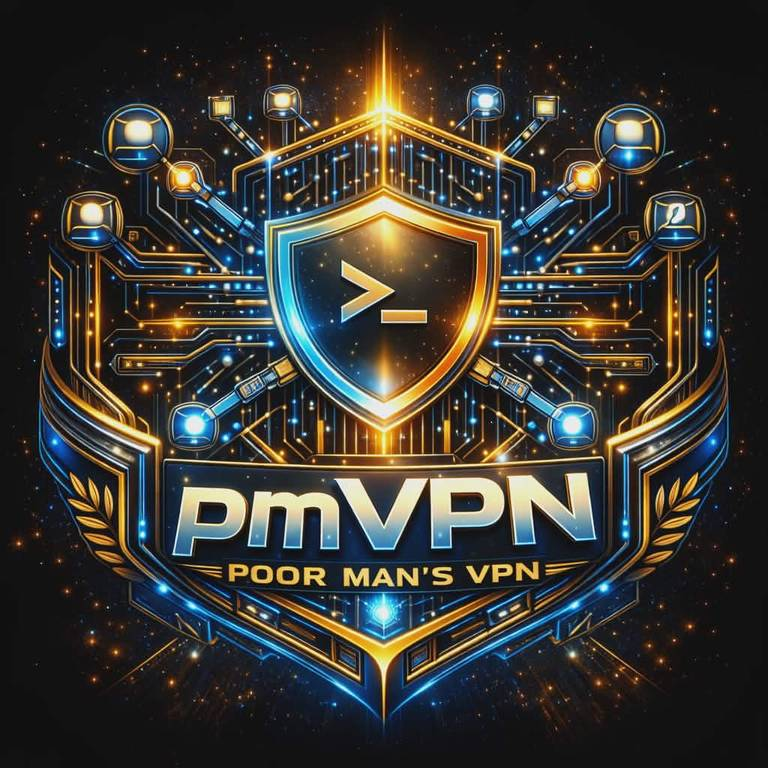

<h1 align="center">pmVPN</h1>

<p align="center"><em>Poor Man's VPN — Wallet-Authenticated Remote Access</em></p>

<p align="center">
  <strong>v0.1.2</strong> · Alpha · GPL-3.0-only
</p>

<p align="center">
  <a href="docs/QUICKSTART.md"><strong>Quick Start</strong></a> ·
  <a href="docs/USAGE.md"><strong>Usage</strong></a> ·
  <a href="docs/DEPLOYMENT.md"><strong>Deploy</strong></a> ·
  <a href="docs/GUIDE-HOSTINGER-VPS.md"><strong>Hostinger VPS</strong></a> ·
  <a href="docs/HOSTINGER-MCP-SETUP.md"><strong>MCP Setup</strong></a> ·
  <a href="docs/PROTOCOL.md"><strong>Protocol</strong></a> ·
  <a href="docs/REMOTE-CONTROL.md"><strong>Remote Control</strong></a> ·
  <a href="docs/DEVELOPMENT.md"><strong>Roadmap</strong></a>
</p>

<br />

<div align="center">
  <picture>
    
  </picture>
</div>

<br />

<div align="center">
  <a href="https://agenticplace.pythai.net">
    <picture>
      
    </picture>
  </a>
</div>

---

> *Your wallet is your key. Your signature is your password. Eight ports. Zero trust required.*

---

## A Note on What This Is

pmVPN exists because remote access should not depend on third parties. No VPN provider standing between you and your machine. No password database waiting to be breached. No SSH key files scattered across devices, lost in backups, or forgotten on decommissioned laptops.

A cryptocurrency wallet already solves the identity problem. It holds a private key you control. It produces signatures that prove who you are without revealing that key. It works the same way whether you are at home, in an airport, or on a phone in another country.

pmVPN takes that identity and makes it the only credential you need. Connect your wallet. Sign a challenge. Eight encrypted ports open between you and your machine — terminal, file transfer, VPN tunnel, AI assistant. Everything over [SSH](https://www.openssh.com/). Everything authenticated by a signature that only your wallet can produce.

The server is five dependencies and an [Ed25519](https://ed25519.cr.yp.to/) host key. The client is a module inside your wallet. The protocol is documented and open. The code is in-house because production infrastructure on a hostile internet should minimize its trust surface.

This is not a consumer product. It is infrastructure for people who run their own machines and want to access them from anywhere, securely, with nothing but a wallet.

---

## What pmVPN Does

**Terminal access.** Open interactive shell sessions on remote Linux machines. Run Claude, bash, vim, htop — anything that runs in a terminal. Real PTY emulation via [node-pty](https://github.com/microsoft/node-pty). Full [xterm.js](https://xtermjs.org/) rendering in the client.

**File transfer.** SFTP on a dedicated port. Browse, upload, download. The file system of your remote machine, accessible through wallet authentication.

**Command execution.** Non-interactive SSH exec for scripting and automation. Run commands on remote machines without opening a terminal session.

**VPN tunneling.** The [PM Protocol](docs/PROTOCOL.md) multiplexes TCP, UDP, and DNS streams over a single SSH channel — inspired by [sshuttle](https://github.com/sshuttle/sshuttle). Route traffic through your server. Resolve DNS through your server. Up to 65,535 concurrent streams through one authenticated connection.

**Provider Gateway.** Port +6 serves an HTTP API for cloud provider coordination. The modular architecture loads provider plugins at runtime — [Hostinger MCP](docs/HOSTINGER-MCP-SETUP.md) is the first, enabling VPS listing, provisioning, and management through wallet-authenticated API calls. See [GUIDE-HOSTINGER-VPS.md](docs/GUIDE-HOSTINGER-VPS.md).

**Fleet Coordination.** Ports 2600-2603 enable multi-server management — control plane, real-time WebSocket events, inter-node mesh, and Prometheus metrics. Optional: activates when `~/.pmvpn/fleet.json` exists. Single-server mode runs exactly as before without it.

**BANKON Vault.** Wallet-signature-gated encrypted credential storage. Pure Node.js crypto — zero npm dependencies. Four modes: signature (default), threshold (2-of-3 recovery), passphrase (offline/network=0), combined (maximum security). AES-256-GCM encryption with per-entry HKDF-SHA512 key derivation. Keys exist only in memory — zeroized on lock. (c) [BANKON](https://bankon.pythai.net) — GPL-3.0 — [cypherpunk2048](https://github.com/cypherpunk2048) standard. See [vault/README.md](modules/vault/README.md).

**Auto-registration.** Any wallet that signs in gets access. No pre-registration. Username derived from wallet address (`w` + first 8 hex chars). Linux user created automatically. Home directory persistent across sessions. Wallet-to-user mapping persisted to `~/.pmvpn/wallets.json`.

**Tiered diagnostics.** `GET /diagnostics` on the Challenge API (port +3). Public: health percentages. Authenticated (any wallet via `X-Wallet` header): own active sessions. Admin: full forensic — CPU, memory, disk, GPU, network interfaces, traffic counters, process list, firewall status, failed SSH attempts, kernel warnings, login history, all active sessions with client IPs and durations.

**dApp Diagnostics.** The client UI includes a privilege-gated diagnostics panel. Wallet signature proves identity; asset holding proves privilege level. Fleet and provider status responses render in the UI, gated by viewer/operator/admin tiers. Uses [viem](https://viem.sh/) for on-chain balance reads — no ethers dependency.

**Multi-host management.** Connect to multiple machines simultaneously. Switch between terminals. Monitor connection status across your infrastructure.

**Claude Remote Control.** Drive your entire pmVPN infrastructure from your phone. [Claude Code](https://docs.anthropic.com/en/docs/claude-code) runs locally on your machine while you interact from [claude.ai/code](https://claude.ai/code) or the Claude mobile app. Describe intent in natural language — Claude reads files, runs commands, edits code, and manages servers. Your wallet keys never leave your device. `./remote-control.sh` to start.

**blocktalk.** Wallet-gated communication rooms for private messaging, file sharing, and AI collaboration. Any wallet can spin up a lightweight self-hosted node — no external infrastructure required. For production messaging, [XMTP](https://xmtp.org/) provides decentralized relay with [MLS](https://www.rfc-editor.org/rfc/rfc9420) end-to-end encryption. Room types: private (1:1), boardroom (team), dojo (human-AI multi-chat), [citadel](docs/CITADEL.md) (blockchain-permanent, token-gated). Throttle controls and permission policies protect all participants.

**Citadel.** Blockchain-registered permanent rooms that survive server death. Access earned by token ownership — [ERC-721](https://eips.ethereum.org/EIPS/eip-721)/[ERC-20](https://eips.ethereum.org/EIPS/eip-20) on EVM chains, [ASA](https://developer.algorand.org/docs/get-details/asa/) on [Algorand](https://algorand.co/). On-chain registry stores room identity and gate rules; content stays encrypted off-chain. Any wallet can resurrect a Citadel on a new server from its chain record. Sustainable platform economics: creation fees split on-chain between protocol treasury and node operators. The foundation for distributed social networking without a platform.

**Crypto-SSH.** Bidirectional key derivation between SSH keys and crypto wallets via [HKDF (RFC 5869)](https://tools.ietf.org/html/rfc5869). Your wallet derives SSH credentials for passwordless server access. Your SSH key derives crypto wallets for asset custody. Heritage: [csshd](https://github.com/cryptoAGI/csshd) — the world's first wallet-login SSH server.

**Self-installation.** pmVPN can bootstrap its own server onto any machine you can reach — even containers with no SSH server installed. The [ssh2](https://github.com/mscdex/ssh2) library IS an SSH server. Upload, install, connect.


https://github.com/xtermjs/xterm.js
https://github.com/xtermjs/shell-engine
https://github.com/xtermjs/xterm-benchmark

---

## Architecture

```
  ┌──────────────────────────────────────────────────────────────┐
  │                        PARSEC Wallet                         │
  │  ┌────────────────────────────────────────────────────────┐  │
  │  │                    pmVPN Module                         │  │
  │  │                                                         │  │
  │  │  ┌─────────┐  ┌───────────┐  ┌──────────┐             │  │
  │  │  │ xterm.js│  │ Connector │  │  Store   │             │  │
  │  │  │Terminal │  │ Auth Flow │  │  Hosts   │             │  │
  │  │  └────┬────┘  └─────┬─────┘  └──────────┘             │  │
  │  │       │              │                                  │  │
  │  │  ─────┴──────────────┴──── Tauri IPC ────────────────  │  │
  │  │                                                         │  │
  │  │  ┌──────────────────────────────────────────────────┐  │  │
  │  │  │              Rust Backend (Tauri 2)               │  │  │
  │  │  │  ┌──────────┐  ┌───────────┐  ┌──────────────┐  │  │  │
  │  │  │  │  russh   │  │  k256     │  │ bankon_vault │  │  │  │
  │  │  │  │SSH Client│  │ EVM Sign  │  │ Key Storage  │  │  │  │
  │  │  │  └──────────┘  └───────────┘  └──────────────┘  │  │  │
  │  │  └──────────────────────────────────────────────────┘  │  │
  │  └────────────────────────────────────────────────────────┘  │
  └──────────────────────────────────────────────────────────────┘
                               │
                    Wallet-Signed SSH (encrypted)
                               │
  ┌──────────────────────────────────────────────────────────────┐
  │                       pmVPN Server                           │
  │                                                              │
  │   Port +0 ─── SSH Shell ──── node-pty PTY ──── /bin/bash    │
  │   Port +1 ─── SFTP ───────── ssh2 SFTP subsystem            │
  │   Port +2 ─── SSH Exec ───── One-shot command execution      │
  │   Port +3 ─── Challenge ──── HTTP nonce endpoint             │
  │   Port +4 ─── WS Bridge ──── Browser terminal + file browser │
  │   Port +5 ─── File Sync ──── Bidirectional synchronization   │
  │   Port +6 ─── Provider GW ── 3 modules, 21 commands            │
  │   Port +7 ─── Admin ──────── Health, diagnostics, sessions   │
  │                                                              │
  │   Auth: viem verifyMessage() ── pure local secp256k1         │
  │   Auto-reg: any wallet → useradd w{addr} → home dir          │
  │   Sessions: live registry → /diagnostics (tiered)            │
  │   Crypto: Ed25519 · curve25519 · chacha20-poly1305           │
  │   Shell: node-pty · Logging: pino · No Express               │
  └──────────────────────────────────────────────────────────────┘
                               │
              Module Registry (21 commands)
                               │
  ┌──────────────────────────────────────────────────────────────┐
  │              hostinger-cloud-provider (5 cmds)               │
  │   hvps · hcreate · hdetails · hssh · hrestart                │
  ├──────────────────────────────────────────────────────────────┤
  │              bankon-vault (9 cmds) — GPLv3                   │
  │   vs · vu · vstore · vget · vls · vdel · vlock · vexport    │
  │   vthreshold — (c) BANKON · cypherpunk2048 standard          │
  ├──────────────────────────────────────────────────────────────┤
  │              fleet-coordination (7 cmds)                      │
  │   fs · fd · fa · fr · fh · fdeploy · fg                      │
  └──────────────────────────────────────────────────────────────┘
                               │
                    Fleet Coordination (optional)
                               │
  ┌──────────────────────────────────────────────────────────────┐
  │                    Fleet Ports (2600-2603)                    │
  │                                                              │
  │   Port +0 ─── Control ────── HTTP REST fleet CRUD, deploy    │
  │   Port +1 ─── Events ─────── WebSocket real-time monitoring  │
  │   Port +2 ─── Mesh ────────── Inter-node heartbeat, sync     │
  │   Port +3 ─── Metrics ────── Prometheus + health endpoint    │
  │                                                              │
  │   Enabled when ~/.pmvpn/fleet.json exists                    │
  │   Hostinger MCP: VPS provisioning via hostinger-api-mcp      │
  └──────────────────────────────────────────────────────────────┘
```

---

## Authentication

The authentication flow replaces SSH keys with wallet signatures. A fresh nonce prevents replay attacks. The signature is verified locally using [viem](https://viem.sh/) — no blockchain RPC, no external service dependency.

```
  Client                                        Server
  ──────                                        ──────

  1. GET /challenge?address=0x...  ──────────►  Generate 32 random bytes
                                                Store nonce (60-second TTL)

     ◄──────────  { nonce, message, expires }   message = "PMVPN:<nonce>:<ts>"

  2. Wallet signs message
     Key retrieved from bankon_vault (Rust)
     EIP-191 personal_sign with keccak256
     Key zeroized after signing

  3. SSH connect to port +0
     password = JSON.stringify({  ──────────►   Parse JSON from password field
       address,                                 viem.verifyMessage() — local crypto
       signature,                               Recover signer address
       nonce                                    Match against wallet map
     })                                         Delete nonce (single-use)
                                                Map wallet to system username
     ◄──────────  AUTH_SUCCESS                  Provision Linux user via warden
                                                 Verify ~/.ssh/pmvpn_wallet binding
                                                 Spawn PTY as uid/gid of jailed user

  4. Terminal I/O flows through SSH channel
     xterm.js ←→ Tauri events ←→ russh ←→ ssh2 ←→ node-pty ←→ bash (as wXXXX)
```

### Keyring — publickey for everything else

The JSON-password method needs a pmVPN client. For stock `ssh`, `sftp`, `rsync`,
`git` and paramiko the wallet signs one more message, `PMVPN-KEYRING:v1:<host
fingerprint>`, and the client derives eight Ed25519 keys from that signature
(HKDF-SHA256, one context per port). The public halves are enrolled with
`POST /keyring` behind the same challenge → viem → `provisionWallet` path; the
private halves stay on the client as openssh-key-v1 files. Every SSH port then
also accepts `publickey`, but only for the key whose index equals the port offset:
`k1-sftp` opens +1 and is refused on +0, +2, +4. See [docs/KEYRING.md](docs/KEYRING.md).

### Jail warden + privilege drop

On first login the server invokes `/usr/local/bin/pmvpn-create-user.sh`
(self-injected from `server/scripts/` on boot, or installed by the bootstrap
flow, or run by an admin via `pmvpn-warden add`). The warden:

- creates `wXXXXXXXX` with locked password (signature is the only credential)
- `chmod 700` on the home, restricted `~/.profile`, blocked cron + ptrace
- applies a per-tier disk quota (admin 1GB · user 10MB)
- writes the wallet binding to `~/.ssh/pmvpn_wallet` (verified on every
  subsequent auth — wrong wallet → rejected)
- generates an ed25519 keypair tagged `pmvpn:<wallet>:v1` and adds the
  pubkey to `~/.ssh/authorized_keys` (gives stock OpenSSH continuity)
- after `POST /keyring`, mirrors the wallet's ring as `pmvpn:<wallet>:k<i>:<slug>`
  lines with per-index options (`restrict`, `internal-sftp`, `port-forwarding`);
  `pmvpn-warden keyring-install|keyring-remove` do the same by hand

The SSH PTY, exec, and SFTP sessions then run under the user's real uid/gid.
SFTP runs in a forked worker that `setuid()`s before any filesystem access,
so Linux ownership and quota actually apply.

The [crypto-ssh module](docs/CRYPTO-SSH.md) extends this with native SSH public key authentication via [HKDF](https://tools.ietf.org/html/rfc5869)-derived Ed25519 keys — eliminating the password-field workaround entirely for clients that support it.

---

## Eight Ports

Base port configurable via `PMVPN_BASE_PORT` (default `2200`). All SSH ports require wallet authentication. All traffic encrypted end-to-end.

| Offset | Service | Protocol | What It Does |
|--------|---------|----------|--------------|
| **+0** | **SSH Shell** | [SSH2](https://www.rfc-editor.org/rfc/rfc4253) | Interactive terminal sessions. Run Claude, bash, vim, anything. Real PTY with window resize support |
| **+1** | **SFTP** | [SSH2/SFTP](https://www.rfc-editor.org/rfc/rfc4254) | File transfer. Browse remote filesystem, upload, download. Dedicated port keeps file ops separate from shell traffic |
| **+2** | **SSH Exec** | SSH2 | Non-interactive commands. Run scripts, cron-style jobs, health checks. Returns stdout, stderr, and exit code |
| **+3** | **Challenge API** | HTTP | Nonce endpoint. Client fetches challenge here before SSH auth. Node built-in `http.createServer` — no Express |
| **+4** | **WS Bridge** | [WebSocket](https://www.rfc-editor.org/rfc/rfc6455) | Browser terminal + SFTP file browser. Wallet-authenticated WebSocket. Live PTY shell + file operations |
| **+5** | **File Sync** | SSH2 | Bidirectional file synchronization between client and server |
| **+6** | **Provider Gateway** | HTTP | Cloud-provider command gateway (Hostinger MCP, fleet ops). Wallet-signed request body. Doubles as the Claude Remote Control auth point |
| **+7** | **Admin** | HTTP | Server health, active sessions, connection metrics |

---

## Quick Start

### Server

```bash
git clone https://github.com/poormanvpn/pmVPN.git
cd pmVPN/pmvpn/server

pnpm install

# Map your wallet address to a system username
export WALLET_USER_MAP="0xYourWalletAddress:yourusername"

# Development (auto-reload)
pnpm run dev

# Production
pnpm run build && pnpm start
```

The server generates an [Ed25519](https://ed25519.cr.yp.to/) host key at `~/.pmvpn/hostkey` on first run. Eight ports bind immediately.

### Client

The pmVPN client is a module inside [PARSEC Wallet](https://github.com/cypherpunk2048/parsec-wallet). From the wallet dashboard, open the pmVPN view, add a host, and connect.

```bash
cd parsec-wallet
pnpm install
pnpm run tauri:dev
```

### Verify

```bash
# Server health
curl http://localhost:2207/status
# → { "version": "0.1.2", "uptime": 42, "wallets": 1 }

# Request a challenge
curl "http://localhost:2203/challenge?address=0xYourAddr"
# → { "nonce": "a1b2...", "message": "PMVPN:a1b2...:1679900000", "expires": 1679900060 }
```

---

## Configuration

### Environment Variables

| Variable | Default | Description |
|----------|---------|-------------|
| `PMVPN_BASE_PORT` | `2200` | Base port (8 ports: base through base+7) |
| `PMVPN_HOST` | `0.0.0.0` | Bind address |
| `WALLET_USER_MAP` | — | Wallet mappings: `0xaddr:user,0xaddr:user` |
| `LOG_LEVEL` | `info` | Logging verbosity: debug, info, warn, error |
| `PMVPN_SHELL` | `/bin/bash` | Shell binary for PTY sessions |
| `PMVPN_HOME_BASE` | `/home` | Base directory for user home directories |

### Wallet Map File

For production, use `~/.pmvpn/wallets.json`:

```json
{
  "0x1234...abcd": { "user": "alice", "role": "admin" },
  "0xabcd...1234": { "user": "bob", "role": "user" }
}
```

JSON file entries take precedence over environment variable entries for the same address.

---

## VPN Tunnel — PM Protocol

The tunnel multiplexes TCP, UDP, and DNS over a single SSH channel using a custom binary protocol inspired by [sshuttle](https://github.com/sshuttle/sshuttle)'s ssnet.

### Frame Format

```
  "PM" (2 bytes)  │  Channel ID (uint16)  │  Command (uint16)  │  Length (uint16)  │  Payload
  ─────────────────┼───────────────────────┼────────────────────┼───────────────────┼──────────
       Magic        │   0–65535 streams     │   See table below  │   0–65535 bytes   │  Data
```

### Commands

| Code | Command | Purpose |
|------|---------|---------|
| 0 | EXIT | Shutdown |
| 1–2 | PING/PONG | Flow control (32KB threshold) |
| 3 | TCP_CONNECT | Open TCP connection: `"4,host,port"` |
| 4 | TCP_STOP | Backpressure |
| 5 | TCP_EOF | Half-close |
| 6 | TCP_DATA | Payload bytes |
| 7–9 | UDP_OPEN/DATA/CLOSE | UDP relay (30s timeout) |
| 10–11 | DNS_REQ/RESPONSE | DNS forwarding (10s timeout) |

Full specification: **[docs/PROTOCOL.md](docs/PROTOCOL.md)**

---

## Security Model

### SSH Hardening

All algorithm choices follow [OpenSSH](https://www.openssh.com/) best practices and [Daniel J. Bernstein](https://cr.yp.to/)'s cryptographic recommendations.

| Parameter | Value | Rationale |
|-----------|-------|-----------|
| Host key | [Ed25519](https://ed25519.cr.yp.to/) | Smallest, fastest, Bernstein curve — no NIST dependency |
| Key exchange | [curve25519-sha256](https://www.rfc-editor.org/rfc/rfc8731) | Best available Diffie-Hellman |
| Cipher | [chacha20-poly1305](https://cr.yp.to/chacha.html)@openssh.com | AEAD, constant-time, no AES side-channel risk |
| Fallback | [aes256-gcm](https://www.rfc-editor.org/rfc/rfc5288) | For clients that don't support ChaCha20 |
| MAC | Implicit (AEAD) | GCM and [Poly1305](https://cr.yp.to/mac.html) handle integrity |
| Banner | `PMVPN` | No version information leaked |
| Max auth tries | 3 | Brute-force mitigation |
| Auth timeout | 30 seconds | Resource exhaustion prevention |
| Agent forwarding | Disabled | Attack surface reduction |
| X11 forwarding | Disabled | Attack surface reduction |

### Credential Storage

**Server side:**

| Item | Where | Protection |
|------|-------|------------|
| Host key | `~/.pmvpn/hostkey` | Ed25519 PEM, chmod 600 |
| Wallet map | `~/.pmvpn/wallets.json` | Plaintext (addresses are public) |
| Nonces | In-memory Map | 60s TTL, single-use, hard cap 1000 |
| Sessions | In-memory | Tied to SSH connection lifecycle |

**Client side:**

| Item | Where | Protection |
|------|-------|------------|
| Private key | [bankon_vault](https://github.com/cypherpunk2048/parsec-wallet) (Rust) | [Argon2id](https://www.rfc-editor.org/rfc/rfc9106) KDF + [AES-256-GCM](https://www.rfc-editor.org/rfc/rfc5116) |
| Signing | Rust memory | Retrieved, used once, zeroized |
| Host fingerprints | `~/.pmvpn/known_hosts.json` | TOFU (Trust On First Use) |
| Connection profiles | localStorage | Host, port, address (no secrets) |

### On Lock

When PARSEC locks (auto-lock timer or manual):
1. All pmVPN SSH sessions disconnect
2. Terminal instances destroyed
3. Signing keys zeroized in Rust memory
4. Connection state reset
5. bankon_vault session locked

---

## Self-Installation & Bootstrap

pmVPN can install its own server onto a remote machine through any existing access channel.

### Three Privilege Levels

| Level | Requirement | Installation | Ports |
|-------|-------------|-------------|-------|
| **User** | Regular SSH/SFTP login | `~/pmvpn-server/` | 8200+ (unprivileged) |
| **Admin** | sudo access | `/opt/pmvpn/` + systemd | 2200+ (standard) |
| **Container** | Any shell | In-container Node.js process | Any available range |

### How It Works

1. Upload pmVPN server via existing SFTP connection
2. Execute install via SSH exec channel
3. Server starts with wallet authentication enabled
4. Client switches to the new pmVPN connection
5. Optionally deploy Ed25519 SSH key for fallback access

### Zero-SSH Environments

pmVPN's [ssh2](https://github.com/mscdex/ssh2) library IS an SSH server. For containers, VMs, or machines with no OpenSSH:
- If Node.js is available, pmVPN runs directly
- If not, deploy a static Node.js binary alongside the server
- Result: SSH + SFTP + terminal access without installing OpenSSH

### SSH Key Persistence

pmVPN can deploy an Ed25519 key to `~/.ssh/authorized_keys` for fallback access:
- Keys are tagged: `ssh-ed25519 AAAA... pmvpn:<wallet>:<timestamp>`
- pmVPN never removes other entries
- Only the deploying wallet can remove its own key
- Standard SSH key access works even if the pmVPN server process is stopped

Full guide: **[docs/BOOTSTRAP.md](docs/BOOTSTRAP.md)**

---

## Production Deployment

### systemd

```ini
[Unit]
Description=pmVPN Server
After=network-online.target

[Service]
Type=simple
WorkingDirectory=/opt/pmvpn/server
ExecStart=/usr/bin/node dist/index.js
Restart=always
Environment=PMVPN_BASE_PORT=2200
Environment=NODE_ENV=production

[Install]
WantedBy=multi-user.target
```

### Docker

```bash
docker run -d --name pmvpn \
  -p 2200-2207:2200-2207 \
  -e WALLET_USER_MAP="0xYourAddr:username" \
  -v pmvpn-data:/root/.pmvpn \
  pmvpn-server
```

### Firewall

```bash
sudo ufw allow 2200:2207/tcp
```

Full guide: **[docs/DEPLOYMENT.md](docs/DEPLOYMENT.md)**

---

## Client Module — PARSEC Integration

The pmVPN client follows [PARSEC](https://github.com/cypherpunk2048/parsec-wallet)'s architecture: vanilla TypeScript frontend, Rust backend via [Tauri 2](https://v2.tauri.app/), no frameworks.

### UI Layout

```
  ┌──────────────┬────────────────────────────────────┐
  │  Host List   │                                    │
  │              │           xterm.js Terminal         │
  │  ■ dev-box   │                                    │
  │    connected │   user@remote:~$                   │
  │              │   claude --model opus               │
  │  □ staging   │   Hello! I'm Claude...             │
  │    offline   │                                    │
  │              │                                    │
  ├──────────────┤                                    │
  │  Add Host    │                                    │
  │  [Name]      │                                    │
  │  [Host]      │                                    │
  │  [Port]      │                                    │
  │  [Wallet]    │                                    │
  │  [Add]       │                                    │
  ├──────────────┴────────────────────────────────────┤
  │  Connected │ Sessions: 1                          │
  └───────────────────────────────────────────────────┘
```

### Tauri Commands

| Command | Parameters | Returns | Purpose |
|---------|------------|---------|---------|
| `pmvpn_connect` | host, port, authPayload | sessionId | Establish SSH connection |
| `pmvpn_disconnect` | sessionId | — | Close SSH session |
| `pmvpn_send_data` | sessionId, data | — | Terminal keystrokes → server |
| `pmvpn_resize` | sessionId, cols, rows | — | Resize remote PTY |
| `pmvpn_sign_challenge` | address, message | signature | EVM signing via bankon_vault |

Full guide: **[docs/CLIENT.md](docs/CLIENT.md)**

---

## File Structure

```
pmvpn/
├── server/                          GPL-3.0-only
│   ├── src/
│   │   ├── index.ts                 Boot all 8 port listeners
│   │   ├── shared.ts               Protocol constants and types
│   │   ├── config/
│   │   │   ├── ports.ts            Port allocation (base + offsets)
│   │   │   └── wallets.ts          Wallet → user mapping loader
│   │   ├── auth/
│   │   │   ├── verifier.ts         viem verifyMessage()
│   │   │   ├── challenge.ts        Nonce store (60s TTL, single-use)
│   │   │   ├── provision.ts        Wallet → jailed user, binding check
│   │   │   └── keyring.ts          Enrolled rings, blob index, authorized_keys mirror
│   │   ├── ssh/
│   │   │   ├── server.ts           ssh2 factory — hardened algorithms
│   │   │   ├── handler.ts          Auth dispatch + session lifecycle
│   │   │   ├── shell.ts            node-pty PTY spawner
│   │   │   └── sftp.ts             SFTP subsystem
│   │   ├── tunnel/
│   │   │   ├── protocol.ts         PM binary protocol (8-byte frames)
│   │   │   ├── mux.ts              Channel multiplexer + flow control
│   │   │   ├── handlers.ts         TCP proxy · UDP relay · DNS forwarder
│   │   │   ├── server.ts           Tunnel server (inside SSH session)
│   │   │   ├── client.ts           Tunnel client (local proxy)
│   │   │   └── firewall.ts         iptables NAT for transparent proxy
│   │   ├── api/
│   │   │   ├── challenge.ts        HTTP nonce endpoint, /status, /diagnostics
│   │   │   └── keyring.ts          POST/GET/DELETE /keyring
│   │   └── utils/
│   │       ├── hostkey.ts          Ed25519 via ssh-keygen, fingerprint
│   │       └── logger.ts           pino structured logging
│   ├── .env.example
│   └── Dockerfile
│
├── remote-control.sh                Claude Code Remote Control launcher
│
├── crypto-ssh/                      GPL-3.0-only — Key derivation module
│   ├── src/
│   │   ├── index.ts                 Module exports
│   │   ├── keyring.ts               Signature → 8 port-scoped keys, openssh-key-v1, bundle (isomorphic)
│   │   ├── wallet-to-ssh.ts         Wallet → SSH: HKDF, native secp256k1, agent bridge
│   │   └── ssh-to-wallet.ts         SSH → Wallet: HKDF, HD wallet, service wallet, hardware
│   ├── bin/pmvpn-keyring.ts         CLI: message · derive · enrol
│   ├── scripts/verify-paramiko.py   Prove a ring key from paramiko (and the wrong-port refusal)
│   └── test/keyring.test.ts         Fixed vector, ssh-keygen cross-check
│
├── shared/                          GPL-3.0-only
│   └── src/
│       ├── constants.ts            Port offsets, protocol version
│       └── types.ts                Auth payload, wallet entry, status
│
├── docs/
│   ├── USAGE.md                    Step-by-step connection guide
│   ├── PROTOCOL.md                 PM tunnel wire format specification
│   ├── DEPLOYMENT.md               Production: systemd, Docker, firewall
│   ├── BOOTSTRAP.md                Self-installation and key exchange
│   ├── CLIENT.md                   PARSEC module documentation
│   ├── ANDROID.md                  Android build and install
│   ├── CRYPTO-SSH.md               Bidirectional key derivation
│   ├── KEYRING.md                  One signature → eight port-scoped keys
│   ├── REMOTE-CONTROL.md           Claude Remote Control
│   └── DEVELOPMENT.md              Roadmap and phase status
│
└── (the licence: ../LICENSE, GPL-3.0-only)
```

---

## Dependencies

### Server — 5 packages

Every dependency is a trust decision. pmVPN minimizes the surface.

| Package | Author | License | Purpose |
|---------|--------|---------|---------|
| [ssh2](https://github.com/mscdex/ssh2) | [Brian White](https://github.com/mscdex) | MIT | Pure JavaScript SSH2 protocol implementation |
| [node-pty](https://github.com/microsoft/node-pty) | [Microsoft](https://github.com/microsoft) | MIT | Real PTY spawning via N-API native binding |
| [viem](https://viem.sh/) | [wevm](https://github.com/wevm) | MIT | [secp256k1](https://www.secg.org/sec2-v2.pdf) signature verification — pure local, no RPC |
| [ws](https://github.com/websockets/ws) | [websockets](https://github.com/websockets) | MIT | WebSocket bridge ([RFC 6455](https://www.rfc-editor.org/rfc/rfc6455)) for browser clients |
| [pino](https://github.com/pinojs/pino) | [Matteo Collina](https://github.com/mcollina) | MIT | Structured JSON logging, high performance |

No [Express](https://expressjs.com/). No dotenv. HTTP via [Node built-in](https://nodejs.org/api/http.html). Config via environment variables.

### Crypto-SSH — 2 packages

| Package | Author | License | Purpose |
|---------|--------|---------|---------|
| [@noble/curves](https://github.com/paulmillr/noble-curves) | [Paul Miller](https://github.com/paulmillr) | MIT | Ed25519 for the keyring — runs in the browser, the same code viem ships |
| [@noble/hashes](https://github.com/paulmillr/noble-hashes) | [Paul Miller](https://github.com/paulmillr) | MIT | SHA-256 and HKDF for the keyring |

The wallet↔SSH derivation paths still use only [`node:crypto`](https://nodejs.org/api/crypto.html) and implement [HKDF (RFC 5869)](https://tools.ietf.org/html/rfc5869) and [BIP-32](https://github.com/bitcoin/bips/blob/master/bip-0032.mediawiki) from scratch; the keyring is isomorphic so the client can derive without a Node runtime.

### Client — Rust

| Crate | Author | Purpose |
|-------|--------|---------|
| [k256](https://github.com/RustCrypto/elliptic-curves) | [RustCrypto](https://github.com/RustCrypto) | [secp256k1](https://www.secg.org/sec2-v2.pdf) ECDSA signing |
| [sha3](https://github.com/RustCrypto/hashes) | [RustCrypto](https://github.com/RustCrypto) | [Keccak256](https://keccak.team/keccak.html) hashing |
| [hex](https://github.com/KokaKiwi/rust-hex) | [KokaKiwi](https://github.com/KokaKiwi) | Hex encoding/decoding |

### Client — TypeScript

| Package | Author | Purpose |
|---------|--------|---------|
| [@xterm/xterm](https://xtermjs.org/) | [xtermjs](https://github.com/xtermjs) | Terminal emulator |
| [@xterm/addon-fit](https://xtermjs.org/) | [xtermjs](https://github.com/xtermjs) | Auto-resize terminal to container |

---

## Documentation

| Document | What It Covers |
|----------|----------------|
| **[USAGE.md](docs/USAGE.md)** | Step-by-step usage guide — server setup, client setup (PARSEC and CLI), local testing, remote machine connection, unprivileged mode, troubleshooting |
| **[PROTOCOL.md](docs/PROTOCOL.md)** | PM tunnel wire format — frame structure, command codes, channel lifecycle, flow control mechanics, security considerations |
| **[DEPLOYMENT.md](docs/DEPLOYMENT.md)** | Production deployment — environment variables, wallets.json, systemd service, firewall rules, health monitoring |
| **[BOOTSTRAP.md](docs/BOOTSTRAP.md)** | Self-installation — user-level, admin-level, and zero-SSH methods, key exchange, authorized_keys management |
| **[CLIENT.md](docs/CLIENT.md)** | Standalone client + PARSEC module — UI layout, WebSocket connection, tabs, Tauri commands, MetaMask auth flow |
| **[ANDROID.md](docs/ANDROID.md)** | Android build + install — build environment (6 steps), APK build, install on phone, browser fallback |
| **[CRYPTO-SSH.md](docs/CRYPTO-SSH.md)** | Bidirectional key derivation — wallet-to-SSH ([HKDF](https://tools.ietf.org/html/rfc5869), native secp256k1, agent bridge), SSH-to-wallet ([BIP-32](https://github.com/bitcoin/bips/blob/master/bip-0032.mediawiki) HD wallet, service wallet, hardware tokens), [csshd](https://github.com/cryptoAGI/csshd) heritage |
| **[KEYRING.md](docs/KEYRING.md)** | One wallet signature → eight port-scoped Ed25519 keys; publickey for OpenSSH, sftp, rsync, paramiko; bundle, CLI, revoke |
| **[BLOCKTALK.md](docs/BLOCKTALK.md)** | blocktalk v2 — wallet-gated communication rooms (private, boardroom, dojo, citadel), [XMTP](https://xmtp.org/) integration with [MLS (RFC 9420)](https://www.rfc-editor.org/rfc/rfc9420) encryption, self-hosted lightweight node, AI agent participation, throttle controls |
| **[CITADEL.md](docs/CITADEL.md)** | Citadel — blockchain-permanent token-gated rooms, on-chain registry ([Algorand](https://algorand.co/) + EVM), 5 gate types ([ERC-721](https://eips.ethereum.org/EIPS/eip-721)/[1155](https://eips.ethereum.org/EIPS/eip-1155)/[20](https://eips.ethereum.org/EIPS/eip-20)/[ASA](https://developer.algorand.org/docs/get-details/asa/)), room resurrection, distributed social networking |
| **[REMOTE-CONTROL.md](docs/REMOTE-CONTROL.md)** | Claude Remote Control — AI-powered server administration from phone, tablet, or any browser |
| **[metamaskbestpractice.md](docs/metamaskbestpractice.md)** | [MetaMask](https://metamask.io/) disconnect standard practice — wallet_revokePermissions, lock state detection, mandatory signature |
| **[QUICKSTART.md](docs/QUICKSTART.md)** | First-experience guide — 3 steps from zero to connected, all modules explained, mobile usage |
| **[NAVIGATION.md](docs/NAVIGATION.md)** | Modular navigation architecture — top-bar module switching, three-domain identity separation (wallet/AI/session), AI interaction boundaries |
| **[AUDIT.md](docs/AUDIT.md)** | Full codebase audit — 29 issues found, 13 fixed, security review, cryptographic verification, limitations, Phase 10 recommendations |
| **[DEVELOPMENT.md](docs/DEVELOPMENT.md)** | Roadmap — 9.8 of 10 phases complete, dependency audit, reference corpus |

---

## Cryptographic Primitives

All primitives are chosen for proven security, patent-free status, and minimal NIST dependency. The selection follows [Daniel J. Bernstein](https://cr.yp.to/)'s cryptographic recommendations and [OpenSSH](https://www.openssh.com/)'s hardening philosophy.

| Function | Algorithm | Security Level | Standard |
|----------|-----------|---------------|----------|
| Wallet identity | [secp256k1](https://www.secg.org/sec2-v2.pdf) ECDSA | 128-bit | [SEC 2](https://www.secg.org/sec2-v2.pdf) |
| Host key | [Ed25519](https://ed25519.cr.yp.to/) | 128-bit | [RFC 8032](https://www.rfc-editor.org/rfc/rfc8032) |
| Key exchange | [curve25519-sha256](https://cr.yp.to/ecdh.html) | 128-bit | [RFC 8731](https://www.rfc-editor.org/rfc/rfc8731) |
| Transport cipher | [ChaCha20-Poly1305](https://cr.yp.to/chacha.html) | 256-bit | [RFC 8439](https://www.rfc-editor.org/rfc/rfc8439) |
| Message hashing | [Keccak-256](https://keccak.team/keccak.html) | 256-bit | [Ethereum Yellow Paper](https://ethereum.github.io/yellowpaper/paper.pdf) |
| Key derivation | [HKDF-SHA256](https://tools.ietf.org/html/rfc5869) | 256-bit | [RFC 5869](https://tools.ietf.org/html/rfc5869) |
| HD wallets | [HMAC-SHA512](https://www.rfc-editor.org/rfc/rfc2104) | 256-bit | [BIP-32](https://github.com/bitcoin/bips/blob/master/bip-0032.mediawiki) |
| Vault KDF | [Argon2id](https://www.rfc-editor.org/rfc/rfc9106) | Memory-hard | [RFC 9106](https://www.rfc-editor.org/rfc/rfc9106) |
| Vault encryption | [AES-256-GCM](https://www.rfc-editor.org/rfc/rfc5116) | 256-bit | [RFC 5116](https://www.rfc-editor.org/rfc/rfc5116) |
| Signature standard | [EIP-191](https://eips.ethereum.org/EIPS/eip-191) personal_sign | — | [Ethereum EIPs](https://eips.ethereum.org/) |

---

## Cypherpunk2048 Compliance

| Principle | How pmVPN Implements It |
|-----------|------------------------|
| **Keys are identity** | Wallet address = SSH identity. No usernames. No passwords. No key files |
| **Verification replaces trust** | [viem.verifyMessage()](https://viem.sh/docs/actions/public/verifyMessage) — mathematical proof of identity, not institutional trust |
| **Privacy** | No blockchain RPC for auth. No tracking. No telemetry. Minimal structured logging |
| **Sovereignty** | Self-hosted server. Your hardware. Your rules. No cloud dependency |
| **Permissionless** | MIT server. Deploy anywhere. No registration. No approval |
| **Minimal trusted components** | 5 server deps. In-house tunnel protocol. No cloud services. No third-party auth |

---

## License

| Component | License | Why |
|-----------|---------|-----|
| **All of pmVPN** (server, client, shared, crypto-ssh, the vault module, blocktalk) | [GPL-3.0-only](../LICENSE) | pmVPN makes, holds and checks keys: copyleft keeps every modification of that code open, so no black-box change to key handling can ship |

Releases up to v0.1.1 keep the licences they were published under (MIT server, shared and crypto-ssh; GPL-3.0
client).

---

## Heritage & Tribute

pmVPN stands on the shoulders of projects and people who built the infrastructure of digital freedom.

<table>
  <tr>
    <td width="160"><strong>Project</strong></td>
    <td><strong>Contribution to pmVPN</strong></td>
  </tr>
  <tr>
    <td><a href="https://www.openssh.com/"><strong>OpenSSH</strong></a></td>
    <td>The <a href="https://www.openbsd.org/">OpenBSD</a> team gave the world secure remote access. Every SSH hardening decision in pmVPN follows their lead: <a href="https://ed25519.cr.yp.to/">Ed25519</a>, <a href="https://cr.yp.to/ecdh.html">curve25519</a>, <a href="https://cr.yp.to/chacha.html">chacha20-poly1305</a>. The algorithms we trust because they earned that trust over 30 years. <em>Thank you, Theo de Raadt and the OpenBSD community.</em></td>
  </tr>
  <tr>
    <td><a href="https://github.com/sshuttle/sshuttle"><strong>sshuttle</strong></a></td>
    <td>Avery Pennarun's "poor man's VPN" proved that you don't need root, kernel modules, or complicated setup to tunnel traffic securely. The elegant simplicity of multiplexing TCP over SSH inspired pmVPN's <a href="docs/PROTOCOL.md">PM Protocol</a>. We <a href="https://github.com/poormanvpn/sshuttle">forked sshuttle</a> as tribute and reference.</td>
  </tr>
  <tr>
    <td><a href="https://github.com/cryptoAGI/csshd"><strong>csshd</strong></a></td>
    <td>The world's first wallet-login SSH server. Built with Python and <a href="https://www.paramiko.org/">paramiko</a>, csshd proved that wallet signatures can replace SSH keys for authentication. The <a href="docs/CRYPTO-SSH.md">crypto-ssh module</a> extends this lineage from proof of concept to bidirectional key derivation. The <a href="https://github.com/cypherpunk2048">cSSHwallet</a> prototypes (CRYPTOSSH, crypto-ssh, csshd2–csshd9, csshdQR) refined the idea through ten iterations.</td>
  </tr>
  <tr>
    <td><a href="https://viem.sh/"><strong>viem</strong></a></td>
    <td>The <a href="https://github.com/wevm">wevm</a> team built the TypeScript Ethereum library that makes wallet signature verification a single function call. Pure local <a href="https://www.secg.org/sec2-v2.pdf">secp256k1</a> cryptography. No RPC. No network dependency.</td>
  </tr>
  <tr>
    <td><a href="https://v2.tauri.app/"><strong>Tauri 2</strong></a></td>
    <td>The Tauri contributors proved that desktop and mobile apps don't need <a href="https://www.electronjs.org/">Electron</a>'s 300MB footprint. Rust backend, system webview, minimal surface. The architecture pmVPN's client is built on.</td>
  </tr>
  <tr>
    <td><a href="https://github.com/cypherpunk2048/parsec-wallet"><strong>PARSEC Wallet</strong></a></td>
    <td>The sovereign Algorand wallet that houses pmVPN as a module. Vanilla TypeScript, bankon_vault encryption, zero-framework philosophy.</td>
  </tr>
  <tr>
    <td><a href="https://github.com/cypherpunk2048"><strong>bankonOS</strong></a></td>
    <td>The self-sovereign cryptocurrency banking operating system. The crypto-ssh authentication pattern that became pmVPN's wallet-based auth originated in bankon-greeter's <a href="https://eips.ethereum.org/EIPS/eip-191">EIP-191</a> verification flow.</td>
  </tr>
  <tr>
    <td><a href="https://github.com/RustCrypto"><strong>RustCrypto</strong></a></td>
    <td>The <a href="https://github.com/RustCrypto/elliptic-curves">k256</a> and <a href="https://github.com/RustCrypto/hashes">sha3</a> crates that handle EVM signing in Rust memory. No JavaScript ever touches the private key during signing.</td>
  </tr>
  <tr>
    <td><a href="https://github.com/mscdex/ssh2"><strong>ssh2</strong></a></td>
    <td>Brian White's pure JavaScript SSH2 implementation. The library that makes pmVPN possible — a complete SSH server without OpenSSH, without C bindings, deployable anywhere Node.js runs.</td>
  </tr>
  <tr>
    <td><a href="https://cr.yp.to/"><strong>djb / cr.yp.to</strong></a></td>
    <td><a href="https://cr.yp.to/">Daniel J. Bernstein</a>'s cryptographic research: <a href="https://ed25519.cr.yp.to/">Ed25519</a>, <a href="https://cr.yp.to/ecdh.html">Curve25519</a>, <a href="https://cr.yp.to/chacha.html">ChaCha20</a>, <a href="https://cr.yp.to/mac.html">Poly1305</a>. Every transport-layer algorithm in pmVPN traces back to his work. Patent-free. Constant-time. Designed for a hostile world.</td>
  </tr>
</table>

---

## Contributors

<p align="center"><em>The idea that a wallet key is the login key</em></p>

<table align="center">
  <tr>
    <td align="center" width="300" style="padding: 24px;">
      <a href="https://github.com/Professor-Codephreak">
        
      </a>
      <br /><br />
      <strong><a href="https://github.com/Professor-Codephreak">Professor Codephreak</a></strong>
      <br />
      <sub><a href="https://github.com/cypherpunk2048">cSSHwallet</a> prototypes · <a href="https://github.com/cypherpunk2048">bankon-greeter</a> auth pattern<br /><a href="https://github.com/cypherpunk2048">cypherpunk2048</a> protocol · <a href="https://github.com/cypherpunk2048/parsec-wallet">PARSEC Wallet</a> · <a href="https://github.com/cypherpunk2048">bankonOS</a><br /><em>Wallet-as-login-key architect</em></sub>
    </td>
    <td align="center" width="300" style="padding: 24px;">
      <a href="https://github.com/Web3dGuy">
        
      </a>
      <br /><br />
      <strong><a href="https://github.com/Web3dGuy">Web3dGuy</a></strong>
      <br />
      <sub>Wallet-authenticated SSH concept · Web3 development<br />3D immersive experience · Spatial interface<br /><em>Wallet-as-login-key architect</em></sub>
    </td>
  </tr>
</table>

---

<p align="center">
  <em>Code is law. Keys are identity. Verification replaces trust.</em>
</p>
<p align="center">
  <a href="https://github.com/cypherpunk2048">cypherpunk2048</a> · <a href="https://github.com/Professor-Codephreak">codephreak</a>
</p>
<p align="center">
  <a href="https://github.com/poormanvpn">github.com/poormanvpn</a>
</p>
